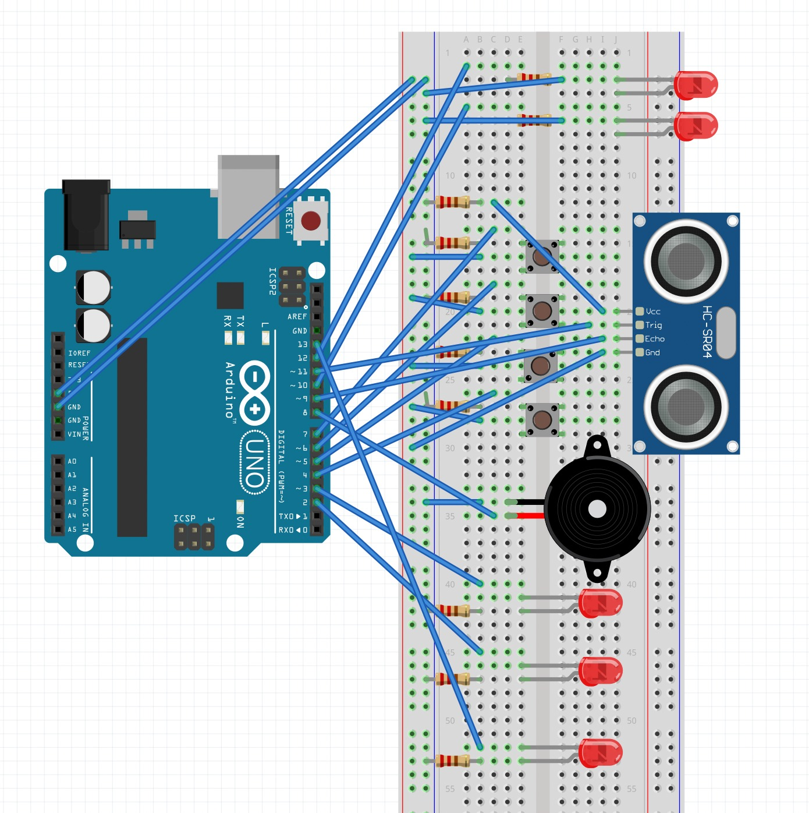

# 🛡️ Ultrasonic Home Security System

A simple Arduino-based home security alarm system using an ultrasonic sensor.  
When an “intruder” is detected within a certain distance, the system triggers an alarm.  
You can disable the alarm by entering a valid passcode via buttons.  

---

## 📌 Overview & Features

- **Objective**: Build a motion-detecting home security alarm using ultrasonic sensing and a passcode check.  
- **Detection**: Uses HC-SR04 ultrasonic sensor to detect objects within a set threshold distance. :contentReference[oaicite:1]{index=1}  
- **Alarm**: Buzzer and LED indicators activate when intrusion is detected. :contentReference[oaicite:2]{index=2}  
- **Passcode interface**: Four buttons (1, 2, 3, 4) allow you to enter a 4-digit code to disable the alarm. :contentReference[oaicite:3]{index=3}  
- **Status LEDs**: Red / Green LEDs indicate alarm state or disarmed state. :contentReference[oaicite:4]{index=4}  

---

## 🛠️ Hardware Requirements

| Component | Quantity | Purpose |
|-----------|----------|---------|
| Arduino Uno (or compatible) | 1 | Main controller |
| HC-SR04 Ultrasonic Sensor | 1 | Detect distance / motion |
| Buzzer | 1 | Sound alarm |
| 3 × LEDs (5 mm) (Red, Yellow, Green) | 3 | Visual status / alert |
| 4 × Tactile (Push) Buttons | 4 | For entering passcode digits |
| 10 kΩ resistors | 4 | Pull-down / button circuits |
| 220 Ω resistors | 3 (for LEDs) | Current limiting |
| Jumper wires | — | Connections |
| Breadboard / prototyping board | 1 | Mounting and wiring support |
| Optional: on/off switch, enclosure | — | Practical deployment |

---

## 🧰 Software & Libraries

- **Arduino IDE** (or an equivalent)  
- Libraries:
  - `SR04` (for ultrasonic distance reading) :contentReference[oaicite:5]{index=5}  
  - `pitches.h` (for generating tones) :contentReference[oaicite:6]{index=6}  
  - `EEPROM` (if you extend to saving codes, optional)  
- The core logic loops: measure distance, check intrusion, activate alarm, read button inputs, compare code.  

---

## ⚡ Circuit Diagram

